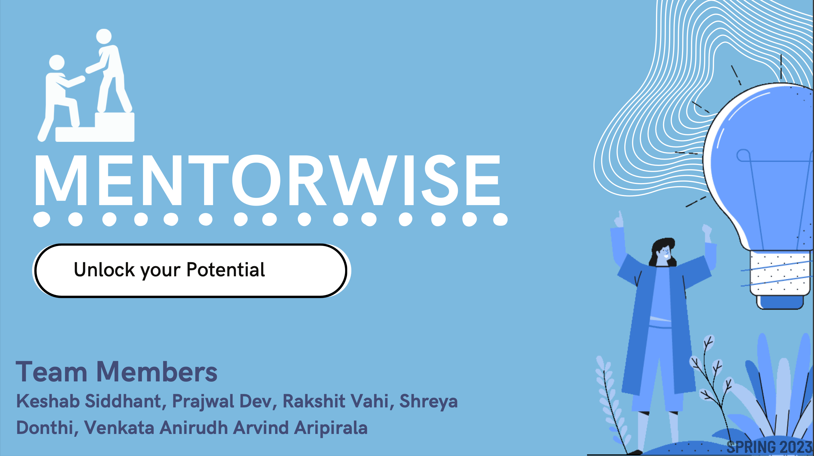

# MentorWise: Digital Product Development and Management Project

**MentorWise** is a digital product developed as part of the **Digital Product Design and Development Course (Jan 2023 – Apr 2023)**. This project aims to bridge the gap between students and professionals by providing a mentorship platform. The repository includes comprehensive documents and designs that showcase the complete lifecycle of the project, from market research to product roadmap planning.

## Repository Contents

This repository contains all the critical deliverables of the **MentorWise** project:

### 📄 [Market Research Document (MRD)](./MRD-MentorWise.pdf)
A detailed document outlining user requirements and key market insights.

### 📄 [Product Requirement Document (PRD)](./PRD-MentorWise.pdf)
Defines product features, goals, and technical specifications.

### 📄 UI/UX Flows and Wireframes [Mentee](./User(Mentee)_UI_UX_Flow.pdf) | [Mentor](./User(Mentor)_UI_UX_Flow.pdf)
Designed using **Balsamiq**, these workflows and wireframes ensure alignment with user needs and business objectives.

### 📄 [Product Roadmap](./Roadmap-MentorWise.pdf)
Highlights key milestones and timelines for the product development lifecycle.

### 📄 [PRD Presentation](./PRD_Presentation.pdf)
Summarizes the product requirements and design approach.

---

## Key Features
- **Market Research**: Defined user requirements based on thorough analysis of target demographics.
- **Use-Case Development**: Demonstrated product functionality and user interactions.
- **Wireframes**: Designed user-friendly workflows for seamless navigation.
- **Roadmap Planning**: Outlined major milestones for efficient product delivery.

---

## About
This project represents a complete lifecycle of digital product design, showcasing how research, planning, and user-centric design come together to build a meaningful product.
